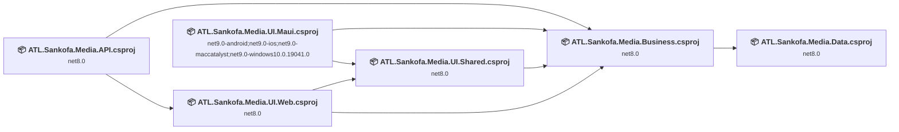
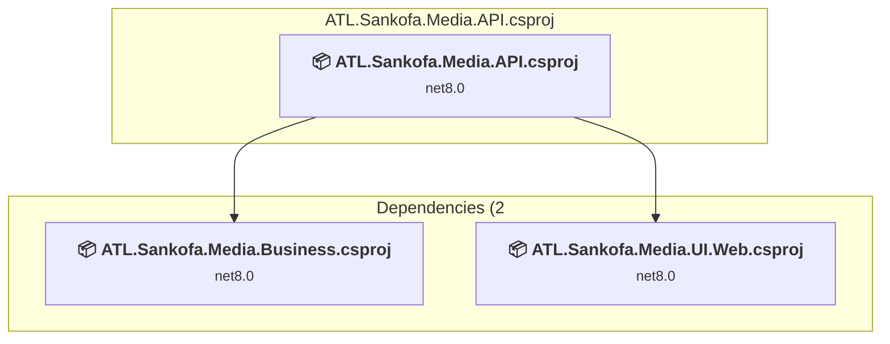
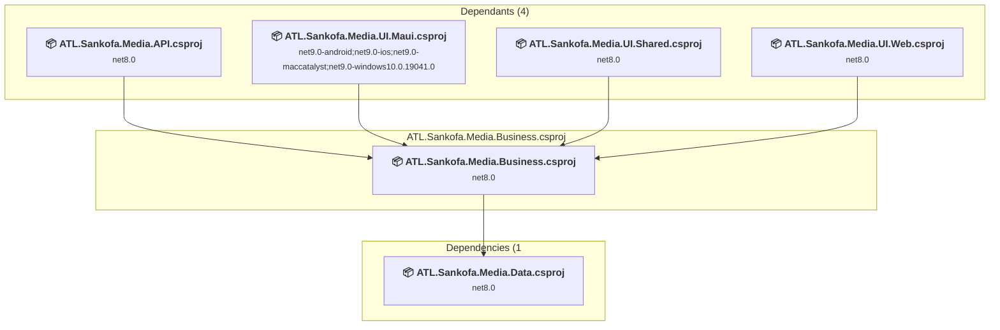
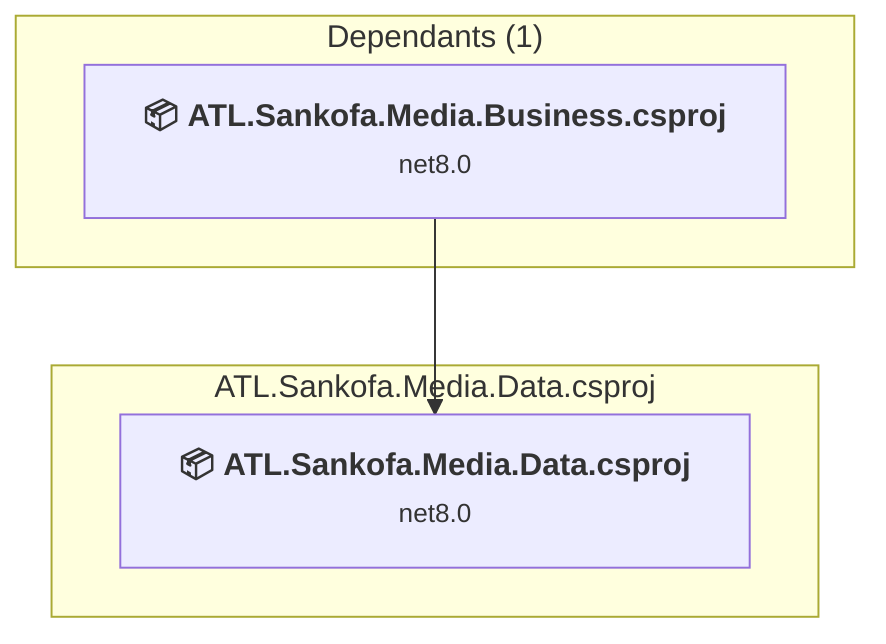
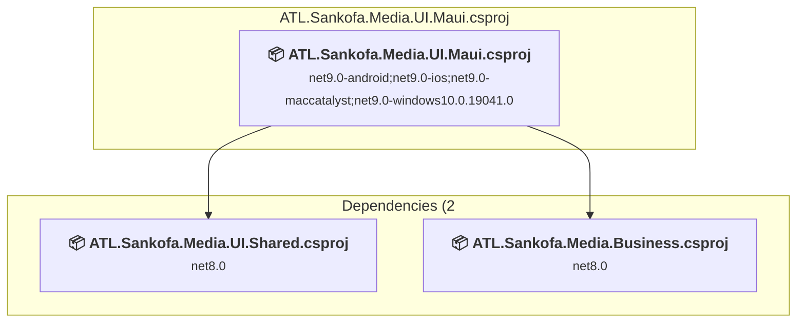
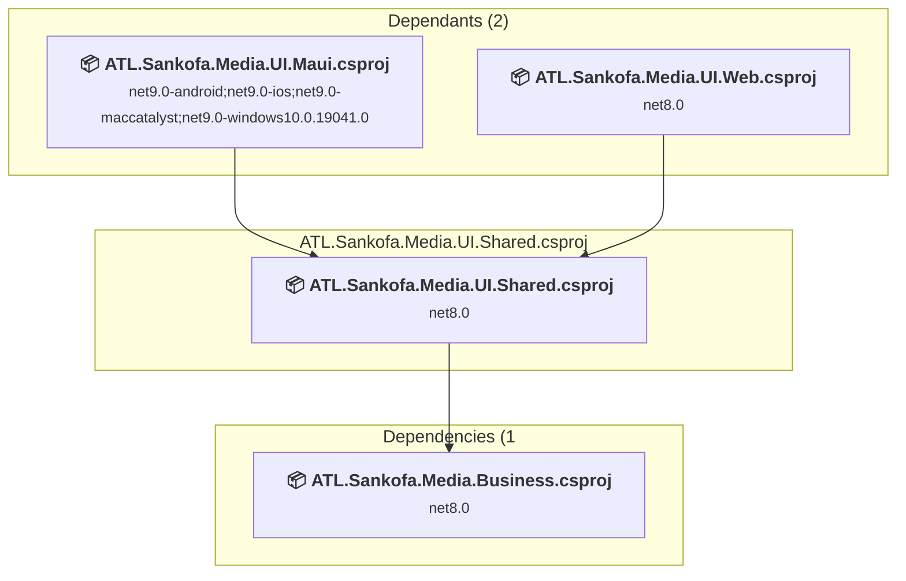
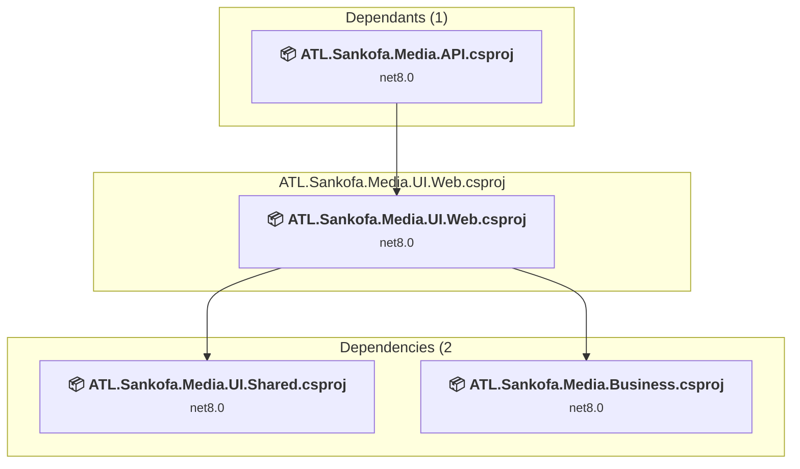

# Projects and dependencies analysis

This document provides a comprehensive overview of the projects and their dependencies in the context of upgrading to .NETCoreApp,Version=v10.0.

## Table of Contents

- [Executive Summary](#executive-Summary)
  - [Highlevel Metrics](#highlevel-metrics)
  - [Projects Compatibility](#projects-compatibility)
  - [Package Compatibility](#package-compatibility)
  - [API Compatibility](#api-compatibility)
  - [Binding Redirect Configuration](#binding-redirect-configuration)
- [Aggregate NuGet packages details](#aggregate-nuget-packages-details)
- [Top API Migration Challenges](#top-api-migration-challenges)
  - [Technologies and Features](#technologies-and-features)
  - [Most Frequent API Issues](#most-frequent-api-issues)
- [Projects Relationship Graph](#projects-relationship-graph)
- [Project Details](#project-details)

  - [ATL.Sankofa.Media.API\ATL.Sankofa.Media.API.csproj](#atlsankofamediaapiatlsankofamediaapicsproj)
  - [ATL.Sankofa.Media.Business\ATL.Sankofa.Media.Business.csproj](#atlsankofamediabusinessatlsankofamediabusinesscsproj)
  - [ATL.Sankofa.Media.Data\ATL.Sankofa.Media.Data.csproj](#atlsankofamediadataatlsankofamediadatacsproj)
  - [ATL.Sankofa.Media.UI.Maui\ATL.Sankofa.Media.UI.Maui.csproj](#atlsankofamediauimauiatlsankofamediauimauicsproj)
  - [ATL.Sankofa.Media.UI.Shared\ATL.Sankofa.Media.UI.Shared.csproj](#atlsankofamediauisharedatlsankofamediauisharedcsproj)
  - [ATL.Sankofa.Media.UI.Web\ATL.Sankofa.Media.UI.Web.csproj](#atlsankofamediauiwebatlsankofamediauiwebcsproj)

## Executive Summary

### Highlevel Metrics

| Metric | Count | Status |
| :--- | :---: | :--- |
| Total Projects | 6 | All require upgrade |
| Total NuGet Packages | 25 | 21 need upgrade |
| Total Code Files | 76 |  |
| Total Code Files with Incidents | 30 |  |
| Total Lines of Code | 4114 |  |
| Total Number of Issues | 218 |  |
| Estimated LOC to modify | 188+ | at least 4.6% of codebase |

### Projects Compatibility

| Project | Target Framework | Difficulty | Package Issues | API Issues | Binding Issues | Est. LOC Impact | Description |
| :--- | :---: | :---: | :---: | :---: | :---: | :---: | :--- |
| [ATL.Sankofa.Media.API\ATL.Sankofa.Media.API.csproj](#atlsankofamediaapiatlsankofamediaapicsproj) | net8.0 | 🟢 Low | 6 | 21 | 0 | 21+ | AspNetCore, Sdk Style = True |
| [ATL.Sankofa.Media.Business\ATL.Sankofa.Media.Business.csproj](#atlsankofamediabusinessatlsankofamediabusinesscsproj) | net8.0 | 🟢 Low | 7 | 26 | 0 | 26+ | ClassLibrary, Sdk Style = True |
| [ATL.Sankofa.Media.Data\ATL.Sankofa.Media.Data.csproj](#atlsankofamediadataatlsankofamediadatacsproj) | net8.0 | 🟢 Low | 3 | 0 | 0 |  | ClassLibrary, Sdk Style = True |
| [ATL.Sankofa.Media.UI.Maui\ATL.Sankofa.Media.UI.Maui.csproj](#atlsankofamediauimauiatlsankofamediauimauicsproj) | net9.0-android;net9.0-ios;net9.0-maccatalyst;net9.0-windows10.0.19041.0 | 🟢 Low | 3 | 123 | 0 | 123+ | ClassLibrary, Sdk Style = True |
| [ATL.Sankofa.Media.UI.Shared\ATL.Sankofa.Media.UI.Shared.csproj](#atlsankofamediauisharedatlsankofamediauisharedcsproj) | net8.0 | 🟢 Low | 2 | 4 | 0 | 4+ | ClassLibrary, Sdk Style = True |
| [ATL.Sankofa.Media.UI.Web\ATL.Sankofa.Media.UI.Web.csproj](#atlsankofamediauiwebatlsankofamediauiwebcsproj) | net8.0 | 🟢 Low | 3 | 14 | 0 | 14+ | AspNetCore, Sdk Style = True |

### Package Compatibility

| Status | Count | Percentage |
| :--- | :---: | :---: |
| ✅ Compatible | 4 | 16.0% |
| ⚠️ Incompatible | 0 | 0.0% |
| 🔄 Upgrade Recommended | 21 | 84.0% |
| ***Total NuGet Packages*** | ***25*** | ***100%*** |

### API Compatibility

| Category | Count | Impact |
| :--- | :---: | :--- |
| 🔴 Binary Incompatible | 21 | High - Require code changes |
| 🟡 Source Incompatible | 130 | Medium - Needs re-compilation and potential conflicting API error fixing |
| 🔵 Behavioral change | 37 | Low - Behavioral changes that may require testing at runtime |
| ✅ Compatible | 9729 |  |
| ***Total APIs Analyzed*** | ***9917*** |  |

## Aggregate NuGet packages details

| Package | Current Version | Suggested Version | Projects | Description |
| :--- | :---: | :---: | :--- | :--- |
| Microsoft.AspNetCore.Authentication.Facebook | 8.0.11 | 10.0.9 | [ATL.Sankofa.Media.API.csproj](#atlsankofamediaapiatlsankofamediaapicsproj) | NuGet package upgrade is recommended |
| Microsoft.AspNetCore.Authentication.Google | 8.0.11 | 10.0.9 | [ATL.Sankofa.Media.API.csproj](#atlsankofamediaapiatlsankofamediaapicsproj) | NuGet package upgrade is recommended |
| Microsoft.AspNetCore.Authentication.JwtBearer | 8.0.11 | 10.0.9 | [ATL.Sankofa.Media.API.csproj](#atlsankofamediaapiatlsankofamediaapicsproj) | NuGet package upgrade is recommended |
| Microsoft.AspNetCore.Authentication.Twitter | 8.0.11 | 10.0.9 | [ATL.Sankofa.Media.API.csproj](#atlsankofamediaapiatlsankofamediaapicsproj) | NuGet package upgrade is recommended |
| Microsoft.AspNetCore.Components.Authorization | 8.0.11 | 10.0.9 | [ATL.Sankofa.Media.UI.Maui.csproj](#atlsankofamediauimauiatlsankofamediauimauicsproj) [ATL.Sankofa.Media.UI.Shared.csproj](#atlsankofamediauisharedatlsankofamediauisharedcsproj) | NuGet package upgrade is recommended |
| Microsoft.AspNetCore.Components.Web | 8.0.28 | 10.0.9 | [ATL.Sankofa.Media.UI.Shared.csproj](#atlsankofamediauisharedatlsankofamediauisharedcsproj) | NuGet package upgrade is recommended |
| Microsoft.AspNetCore.Components.WebAssembly | 8.0.28 | 10.0.9 | [ATL.Sankofa.Media.UI.Web.csproj](#atlsankofamediauiwebatlsankofamediauiwebcsproj) | NuGet package upgrade is recommended |
| Microsoft.AspNetCore.Components.WebAssembly.Authentication | 8.0.11 | 10.0.9 | [ATL.Sankofa.Media.UI.Web.csproj](#atlsankofamediauiwebatlsankofamediauiwebcsproj) | NuGet package upgrade is recommended |
| Microsoft.AspNetCore.Components.WebAssembly.DevServer | 8.0.28 | 10.0.9 | [ATL.Sankofa.Media.UI.Web.csproj](#atlsankofamediauiwebatlsankofamediauiwebcsproj) | NuGet package upgrade is recommended |
| Microsoft.AspNetCore.Components.WebAssembly.Server | 8.0.11 | 10.0.9 | [ATL.Sankofa.Media.API.csproj](#atlsankofamediaapiatlsankofamediaapicsproj) | NuGet package upgrade is recommended |
| Microsoft.AspNetCore.Components.WebView.Maui | 9.0.120 |  | [ATL.Sankofa.Media.UI.Maui.csproj](#atlsankofamediauimauiatlsankofamediauimauicsproj) | ✅Compatible |
| Microsoft.AspNetCore.Identity.EntityFrameworkCore | 8.0.11 | 10.0.9 | [ATL.Sankofa.Media.API.csproj](#atlsankofamediaapiatlsankofamediaapicsproj) [ATL.Sankofa.Media.Business.csproj](#atlsankofamediabusinessatlsankofamediabusinesscsproj) [ATL.Sankofa.Media.Data.csproj](#atlsankofamediadataatlsankofamediadatacsproj) | NuGet package upgrade is recommended |
| Microsoft.EntityFrameworkCore.SqlServer | 8.0.11 | 10.0.9 | [ATL.Sankofa.Media.Data.csproj](#atlsankofamediadataatlsankofamediadatacsproj) | NuGet package upgrade is recommended |
| Microsoft.EntityFrameworkCore.Tools | 8.0.11 | 10.0.9 | [ATL.Sankofa.Media.Data.csproj](#atlsankofamediadataatlsankofamediadatacsproj) | NuGet package upgrade is recommended |
| Microsoft.Extensions.Configuration.Abstractions | 8.0.0 | 10.0.9 | [ATL.Sankofa.Media.Business.csproj](#atlsankofamediabusinessatlsankofamediabusinesscsproj) | NuGet package upgrade is recommended |
| Microsoft.Extensions.Configuration.Binder | 8.0.2 | 10.0.9 | [ATL.Sankofa.Media.Business.csproj](#atlsankofamediabusinessatlsankofamediabusinesscsproj) | NuGet package upgrade is recommended |
| Microsoft.Extensions.Configuration.Json | 9.0.9 | 10.0.9 | [ATL.Sankofa.Media.UI.Maui.csproj](#atlsankofamediauimauiatlsankofamediauimauicsproj) | NuGet package upgrade is recommended |
| Microsoft.Extensions.DependencyInjection | 8.0.1 | 10.0.9 | [ATL.Sankofa.Media.Business.csproj](#atlsankofamediabusinessatlsankofamediabusinesscsproj) | NuGet package upgrade is recommended |
| Microsoft.Extensions.Http | 8.0.1 | 10.0.9 | [ATL.Sankofa.Media.Business.csproj](#atlsankofamediabusinessatlsankofamediabusinesscsproj) | NuGet package upgrade is recommended |
| Microsoft.Extensions.Logging.Debug | 9.0.9 | 10.0.9 | [ATL.Sankofa.Media.UI.Maui.csproj](#atlsankofamediauimauiatlsankofamediauimauicsproj) | NuGet package upgrade is recommended |
| Microsoft.Extensions.Options | 8.0.2 | 10.0.9 | [ATL.Sankofa.Media.Business.csproj](#atlsankofamediabusinessatlsankofamediabusinesscsproj) | NuGet package upgrade is recommended |
| Microsoft.IdentityModel.Tokens | 8.0.2 |  | [ATL.Sankofa.Media.Business.csproj](#atlsankofamediabusinessatlsankofamediabusinesscsproj) | ✅Compatible |
| Microsoft.Maui.Controls | 9.0.120 |  | [ATL.Sankofa.Media.UI.Maui.csproj](#atlsankofamediauimauiatlsankofamediauimauicsproj) | ✅Compatible |
| System.IdentityModel.Tokens.Jwt | 8.0.2 |  | [ATL.Sankofa.Media.Business.csproj](#atlsankofamediabusinessatlsankofamediabusinesscsproj) | ✅Compatible |
| System.Text.Json | 8.0.5 | 10.0.9 | [ATL.Sankofa.Media.Business.csproj](#atlsankofamediabusinessatlsankofamediabusinesscsproj) | NuGet package upgrade is recommended |

## Top API Migration Challenges

### Technologies and Features

| Technology | Issues | Percentage | Migration Path |
| :--- | :---: | :---: | :--- |
| IdentityModel & Claims-based Security | 13 | 6.9% | Windows Identity Foundation (WIF), SAML, and claims-based authentication APIs that have been replaced by modern identity libraries. WIF was the original identity framework for .NET Framework. Migrate to Microsoft.IdentityModel.* packages (modern identity stack). |

### Most Frequent API Issues

| API | Count | Percentage | Category |
| :--- | :---: | :---: | :--- |
| T:Microsoft.Maui.Controls.BindingMode | 20 | 10.6% | Source Incompatible |
| T:System.Net.Http.HttpContent | 16 | 8.5% | Behavioral Change |
| T:System.Uri | 15 | 8.0% | Behavioral Change |
| P:Microsoft.Maui.Hosting.MauiAppBuilder.Services | 9 | 4.8% | Source Incompatible |
| M:System.Uri.#ctor(System.String) | 6 | 3.2% | Behavioral Change |
| T:Microsoft.Maui.Storage.SecureStorage | 6 | 3.2% | Source Incompatible |
| T:Microsoft.Maui.Storage.ISecureStorage | 6 | 3.2% | Source Incompatible |
| P:Microsoft.Maui.Storage.SecureStorage.Default | 6 | 3.2% | Source Incompatible |
| T:Microsoft.Maui.Hosting.MauiApp | 5 | 2.7% | Source Incompatible |
| P:Microsoft.Maui.Authentication.WebAuthenticatorResult.Properties | 4 | 2.1% | Source Incompatible |
| F:Microsoft.Maui.Controls.BindingMode.TwoWay | 3 | 1.6% | Source Incompatible |
| F:Microsoft.Maui.Controls.BindingMode.OneWayToSource | 3 | 1.6% | Source Incompatible |
| P:Microsoft.Maui.Hosting.MauiAppBuilder.Configuration | 3 | 1.6% | Source Incompatible |
| T:Microsoft.Maui.Hosting.MauiAppBuilder | 3 | 1.6% | Source Incompatible |
| T:Microsoft.AspNetCore.Authentication.JwtBearer.JwtBearerDefaults | 2 | 1.1% | Source Incompatible |
| F:Microsoft.AspNetCore.Authentication.JwtBearer.JwtBearerDefaults.AuthenticationScheme | 2 | 1.1% | Source Incompatible |
| T:System.IdentityModel.Tokens.Jwt.JwtSecurityTokenHandler | 2 | 1.1% | Binary Incompatible |
| M:System.IdentityModel.Tokens.Jwt.JwtSecurityTokenHandler.#ctor | 2 | 1.1% | Binary Incompatible |
| M:Microsoft.Extensions.DependencyInjection.OptionsConfigurationServiceCollectionExtensions.Configure''1(Microsoft.Extensions.DependencyInjection.IServiceCollection,Microsoft.Extensions.Configuration.IConfiguration) | 2 | 1.1% | Binary Incompatible |
| F:Microsoft.Maui.Controls.BindingMode.Default | 2 | 1.1% | Source Incompatible |
| P:Microsoft.Maui.Controls.BindableProperty.DefaultBindingMode | 2 | 1.1% | Source Incompatible |
| M:Microsoft.Maui.Storage.ISecureStorage.Remove(System.String) | 2 | 1.1% | Source Incompatible |
| M:Microsoft.Maui.Storage.ISecureStorage.SetAsync(System.String,System.String) | 2 | 1.1% | Source Incompatible |
| M:Microsoft.Maui.Storage.ISecureStorage.GetAsync(System.String) | 2 | 1.1% | Source Incompatible |
| T:Microsoft.Maui.Controls.Xaml.Extensions | 2 | 1.1% | Source Incompatible |
| M:Microsoft.Maui.Controls.ContentPage.#ctor | 2 | 1.1% | Source Incompatible |
| M:Microsoft.Maui.MauiApplication.#ctor(System.IntPtr,Android.Runtime.JniHandleOwnership) | 2 | 1.1% | Binary Incompatible |
| T:Microsoft.Maui.Controls.Window | 2 | 1.1% | Source Incompatible |
| M:Microsoft.Maui.Controls.Application.#ctor | 2 | 1.1% | Source Incompatible |
| M:Microsoft.Extensions.Configuration.ConfigurationBinder.Get''1(Microsoft.Extensions.Configuration.IConfiguration) | 1 | 0.5% | Binary Incompatible |
| P:Microsoft.AspNetCore.Authentication.Twitter.TwitterOptions.RetrieveUserDetails | 1 | 0.5% | Source Incompatible |
| P:Microsoft.AspNetCore.Authentication.Twitter.TwitterOptions.ConsumerSecret | 1 | 0.5% | Source Incompatible |
| P:Microsoft.AspNetCore.Authentication.Twitter.TwitterOptions.ConsumerKey | 1 | 0.5% | Source Incompatible |
| P:Microsoft.AspNetCore.Authentication.Facebook.FacebookOptions.AppSecret | 1 | 0.5% | Source Incompatible |
| P:Microsoft.AspNetCore.Authentication.Facebook.FacebookOptions.AppId | 1 | 0.5% | Source Incompatible |
| P:Microsoft.AspNetCore.Authentication.JwtBearer.JwtBearerOptions.TokenValidationParameters | 1 | 0.5% | Source Incompatible |
| T:Microsoft.Extensions.DependencyInjection.JwtBearerExtensions | 1 | 0.5% | Source Incompatible |
| M:Microsoft.Extensions.DependencyInjection.JwtBearerExtensions.AddJwtBearer(Microsoft.AspNetCore.Authentication.AuthenticationBuilder,System.Action{Microsoft.AspNetCore.Authentication.JwtBearer.JwtBearerOptions}) | 1 | 0.5% | Source Incompatible |
| T:Microsoft.Extensions.DependencyInjection.GoogleExtensions | 1 | 0.5% | Source Incompatible |
| M:Microsoft.Extensions.DependencyInjection.GoogleExtensions.AddGoogle(Microsoft.AspNetCore.Authentication.AuthenticationBuilder,System.Action{Microsoft.AspNetCore.Authentication.Google.GoogleOptions}) | 1 | 0.5% | Source Incompatible |
| T:Microsoft.Extensions.DependencyInjection.FacebookAuthenticationOptionsExtensions | 1 | 0.5% | Source Incompatible |
| M:Microsoft.Extensions.DependencyInjection.FacebookAuthenticationOptionsExtensions.AddFacebook(Microsoft.AspNetCore.Authentication.AuthenticationBuilder,System.Action{Microsoft.AspNetCore.Authentication.Facebook.FacebookOptions}) | 1 | 0.5% | Source Incompatible |
| T:Microsoft.Extensions.DependencyInjection.TwitterExtensions | 1 | 0.5% | Source Incompatible |
| M:Microsoft.Extensions.DependencyInjection.TwitterExtensions.AddTwitter(Microsoft.AspNetCore.Authentication.AuthenticationBuilder,System.Action{Microsoft.AspNetCore.Authentication.Twitter.TwitterOptions}) | 1 | 0.5% | Source Incompatible |
| T:Microsoft.Extensions.DependencyInjection.IdentityEntityFrameworkBuilderExtensions | 1 | 0.5% | Source Incompatible |
| M:Microsoft.Extensions.DependencyInjection.IdentityEntityFrameworkBuilderExtensions.AddEntityFrameworkStores''1(Microsoft.AspNetCore.Identity.IdentityBuilder) | 1 | 0.5% | Source Incompatible |
| T:System.IdentityModel.Tokens.Jwt.JwtHeader | 1 | 0.5% | Binary Incompatible |
| P:System.IdentityModel.Tokens.Jwt.JwtSecurityToken.Header | 1 | 0.5% | Binary Incompatible |
| P:System.IdentityModel.Tokens.Jwt.JwtHeader.Alg | 1 | 0.5% | Binary Incompatible |
| M:System.IdentityModel.Tokens.Jwt.JwtSecurityTokenHandler.ValidateToken(System.String,Microsoft.IdentityModel.Tokens.TokenValidationParameters,Microsoft.IdentityModel.Tokens.SecurityToken@) | 1 | 0.5% | Binary Incompatible |

## Projects Relationship Graph

Legend:
📦 SDK-style project
⚙️ Classic project

## Project Details

### ATL.Sankofa.Media.API\ATL.Sankofa.Media.API.csproj

#### Project Info

- **Current Target Framework:** net8.0
- **Proposed Target Framework:** net10.0
- **SDK-style**: True
- **Project Kind:** AspNetCore
- **Dependencies**: 2
- **Dependants**: 0
- **Number of Files**: 9
- **Number of Files with Incidents**: 2
- **Lines of Code**: 701
- **Estimated LOC to modify**: 21+ (at least 3.0% of the project)

#### Dependency Graph

Legend:
📦 SDK-style project
⚙️ Classic project

### API Compatibility

| Category | Count | Impact |
| :--- | :---: | :--- |
| 🔴 Binary Incompatible | 1 | High - Require code changes |
| 🟡 Source Incompatible | 20 | Medium - Needs re-compilation and potential conflicting API error fixing |
| 🔵 Behavioral change | 0 | Low - Behavioral changes that may require testing at runtime |
| ✅ Compatible | 985 |  |
| ***Total APIs Analyzed*** | ***1006*** |  |

### ATL.Sankofa.Media.Business\ATL.Sankofa.Media.Business.csproj

#### Project Info

- **Current Target Framework:** net8.0
- **Proposed Target Framework:** net10.0
- **SDK-style**: True
- **Project Kind:** ClassLibrary
- **Dependencies**: 1
- **Dependants**: 4
- **Number of Files**: 27
- **Number of Files with Incidents**: 5
- **Lines of Code**: 1987
- **Estimated LOC to modify**: 26+ (at least 1.3% of the project)

#### Dependency Graph

Legend:
📦 SDK-style project
⚙️ Classic project

### API Compatibility

| Category | Count | Impact |
| :--- | :---: | :--- |
| 🔴 Binary Incompatible | 15 | High - Require code changes |
| 🟡 Source Incompatible | 1 | Medium - Needs re-compilation and potential conflicting API error fixing |
| 🔵 Behavioral change | 10 | Low - Behavioral changes that may require testing at runtime |
| ✅ Compatible | 2776 |  |
| ***Total APIs Analyzed*** | ***2802*** |  |

#### Project Technologies and Features

| Technology | Issues | Percentage | Migration Path |
| :--- | :---: | :---: | :--- |
| IdentityModel & Claims-based Security | 13 | 50.0% | Windows Identity Foundation (WIF), SAML, and claims-based authentication APIs that have been replaced by modern identity libraries. WIF was the original identity framework for .NET Framework. Migrate to Microsoft.IdentityModel.* packages (modern identity stack). |

### ATL.Sankofa.Media.Data\ATL.Sankofa.Media.Data.csproj

#### Project Info

- **Current Target Framework:** net8.0
- **Proposed Target Framework:** net10.0
- **SDK-style**: True
- **Project Kind:** ClassLibrary
- **Dependencies**: 0
- **Dependants**: 1
- **Number of Files**: 19
- **Number of Files with Incidents**: 1
- **Lines of Code**: 609
- **Estimated LOC to modify**: 0+ (at least 0.0% of the project)

#### Dependency Graph

Legend:
📦 SDK-style project
⚙️ Classic project

### API Compatibility

| Category | Count | Impact |
| :--- | :---: | :--- |
| 🔴 Binary Incompatible | 0 | High - Require code changes |
| 🟡 Source Incompatible | 0 | Medium - Needs re-compilation and potential conflicting API error fixing |
| 🔵 Behavioral change | 0 | Low - Behavioral changes that may require testing at runtime |
| ✅ Compatible | 975 |  |
| ***Total APIs Analyzed*** | ***975*** |  |

### ATL.Sankofa.Media.UI.Maui\ATL.Sankofa.Media.UI.Maui.csproj

#### Project Info

- **Current Target Framework:** net9.0-android;net9.0-ios;net9.0-maccatalyst;net9.0-windows10.0.19041.0
- **Proposed Target Framework:** net9.0-android;net9.0-ios;net9.0-maccatalyst;net9.0-windows10.0.19041.0;net10.0-windows
- **SDK-style**: True
- **Project Kind:** ClassLibrary
- **Dependencies**: 2
- **Dependants**: 0
- **Number of Files**: 27
- **Number of Files with Incidents**: 11
- **Lines of Code**: 233
- **Estimated LOC to modify**: 123+ (at least 52.8% of the project)

#### Dependency Graph

Legend:
📦 SDK-style project
⚙️ Classic project

### API Compatibility

| Category | Count | Impact |
| :--- | :---: | :--- |
| 🔴 Binary Incompatible | 5 | High - Require code changes |
| 🟡 Source Incompatible | 109 | Medium - Needs re-compilation and potential conflicting API error fixing |
| 🔵 Behavioral change | 9 | Low - Behavioral changes that may require testing at runtime |
| ✅ Compatible | 917 |  |
| ***Total APIs Analyzed*** | ***1040*** |  |

### ATL.Sankofa.Media.UI.Shared\ATL.Sankofa.Media.UI.Shared.csproj

#### Project Info

- **Current Target Framework:** net8.0
- **Proposed Target Framework:** net10.0
- **SDK-style**: True
- **Project Kind:** ClassLibrary
- **Dependencies**: 1
- **Dependants**: 2
- **Number of Files**: 13
- **Number of Files with Incidents**: 4
- **Lines of Code**: 192
- **Estimated LOC to modify**: 4+ (at least 2.1% of the project)

#### Dependency Graph

Legend:
📦 SDK-style project
⚙️ Classic project

### API Compatibility

| Category | Count | Impact |
| :--- | :---: | :--- |
| 🔴 Binary Incompatible | 0 | High - Require code changes |
| 🟡 Source Incompatible | 0 | Medium - Needs re-compilation and potential conflicting API error fixing |
| 🔵 Behavioral change | 4 | Low - Behavioral changes that may require testing at runtime |
| ✅ Compatible | 1651 |  |
| ***Total APIs Analyzed*** | ***1655*** |  |

### ATL.Sankofa.Media.UI.Web\ATL.Sankofa.Media.UI.Web.csproj

#### Project Info

- **Current Target Framework:** net8.0
- **Proposed Target Framework:** net10.0
- **SDK-style**: True
- **Project Kind:** AspNetCore
- **Dependencies**: 2
- **Dependants**: 1
- **Number of Files**: 26
- **Number of Files with Incidents**: 7
- **Lines of Code**: 392
- **Estimated LOC to modify**: 14+ (at least 3.6% of the project)

#### Dependency Graph

Legend:
📦 SDK-style project
⚙️ Classic project

### API Compatibility

| Category | Count | Impact |
| :--- | :---: | :--- |
| 🔴 Binary Incompatible | 0 | High - Require code changes |
| 🟡 Source Incompatible | 0 | Medium - Needs re-compilation and potential conflicting API error fixing |
| 🔵 Behavioral change | 14 | Low - Behavioral changes that may require testing at runtime |
| ✅ Compatible | 2425 |  |
| ***Total APIs Analyzed*** | ***2439*** |  |

